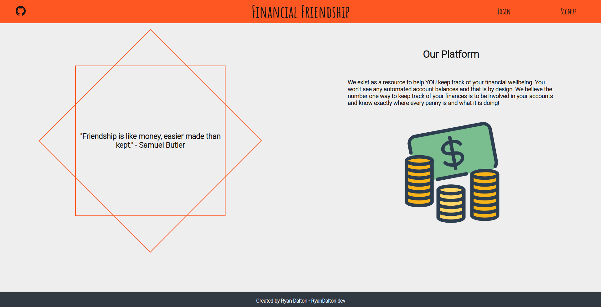

# Financial Friendship

[Ryan Dalton](https://github.com/DaltonR121)

Manage your finances at [Financial Friendship](https://spacexchange.herokuapp.com/)

According to Charles Schwab's [2019 Modern Wealth Index Survey](https://www.aboutschwab.com/modernwealth2019), about 59% of adults in the U.S. admit to living paycheck to paycheck.  What is the best way to take control of your finances?  Be INVOLVED in your finances!  Financial Friendship is an application designed with the idea of manually updating the information here weekly or even daily!  Building a habit of knowing what is going on with your money is the best way to keep more of it!

## Index

- [API Documentation](https://github.com/DaltonR121/FinancialFriendship/wiki/API-Routes)
- [Database Schema](https://github.com/DaltonR121/FinancialFriendship/wiki/Database-Schema)
- [Frontend Routes](https://github.com/DaltonR121/FinancialFriendship/wiki/Frontend-Routes)
- [MVP Feature List](https://github.com/DaltonR121/FinancialFriendship/wiki/MVP-Feature-List)
- [User Stories](https://github.com/DaltonR121/FinancialFriendship/wiki/User-Stories)

## Technologies Used

- JavaScript
- React/Redux
- Chart.js
- CSS
- Python
- Flask/SQLAlchemy

## Overview

The idea for Financial Friendship came from a spreadsheet I actually keep for my own family's finances.  It occurred to me that the more often I updated that spreadsheet, the more in-tune I felt with our finances.  This application is essentially modeled after that spreadsheet!  When a user first accesses the application, they are greeted by the splash page with links to Login or Signup.

